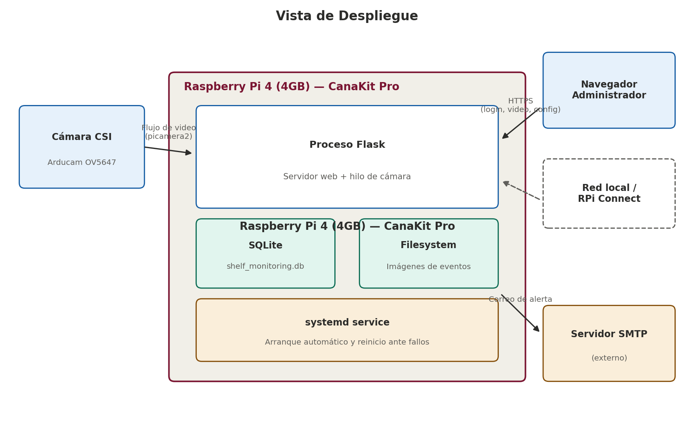
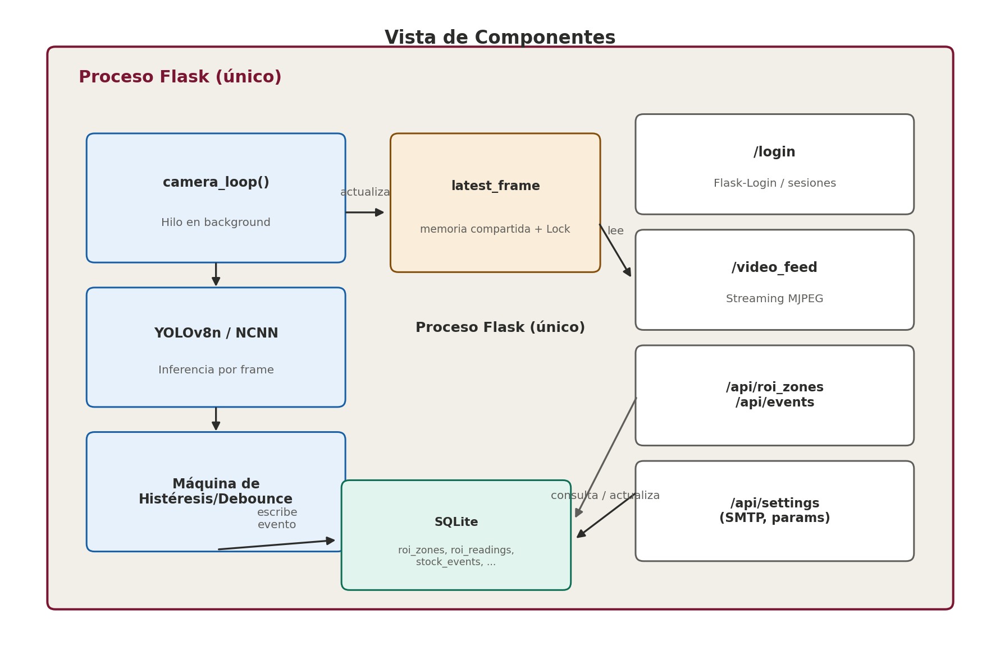
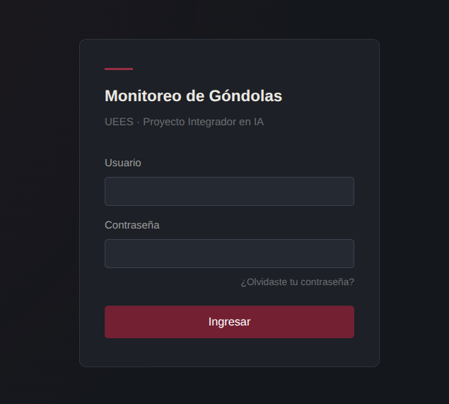
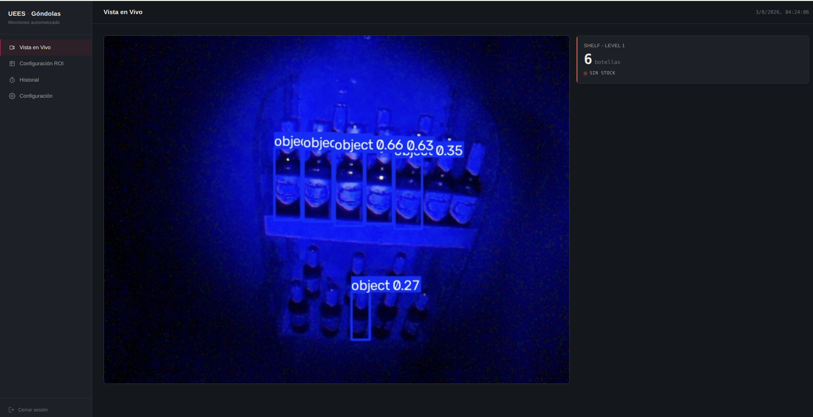
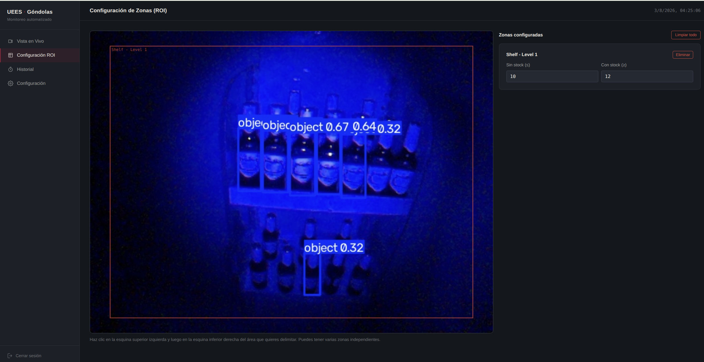
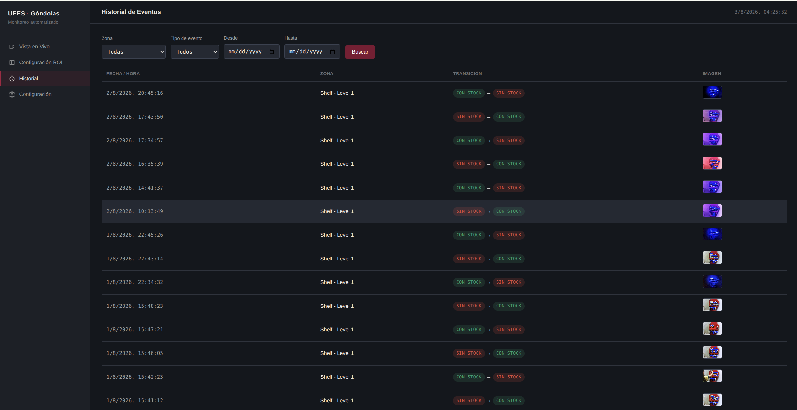
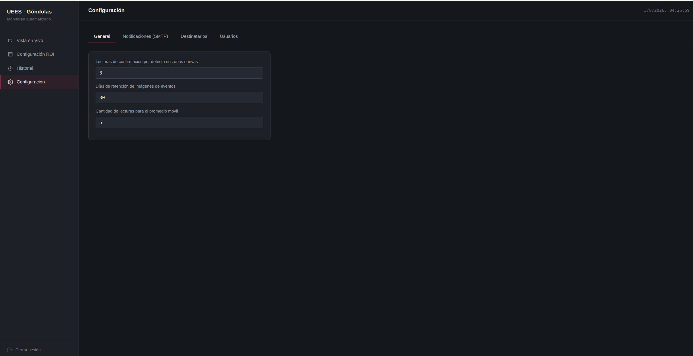
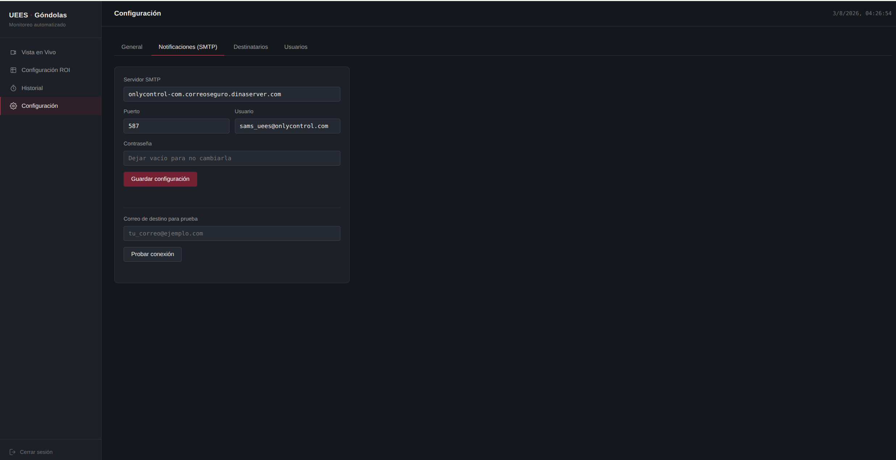
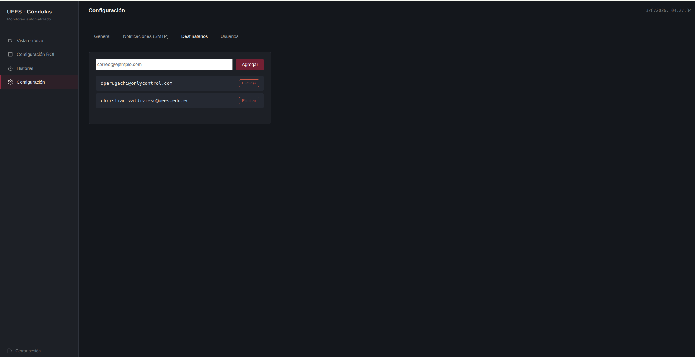
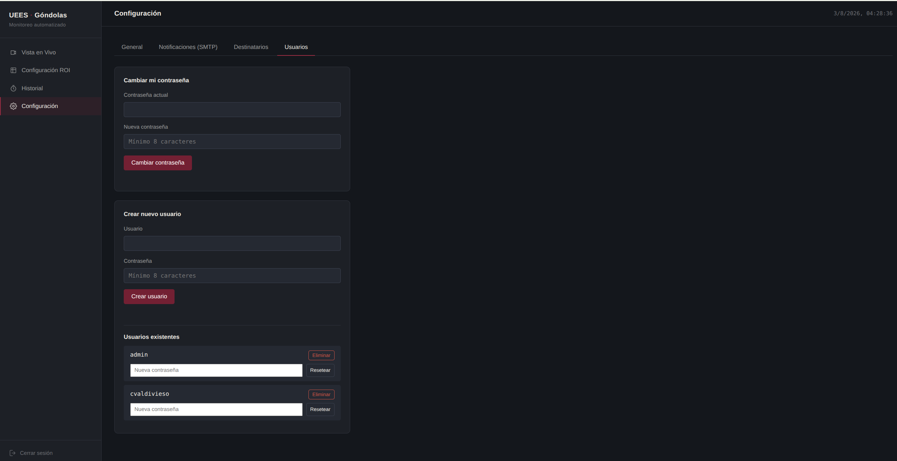

# Monitoreo Automatizado de Góndolas en Retail

**Proyecto Integrador en Inteligencia Artificial — UEES**
Universidad de Especialidades Espíritu Santo · Grupo #2
Profesora: Alexandra Jacqueline Arciniegas Coral

Sistema de visión artificial que monitorea góndolas de retail en tiempo real, detecta cambios en el nivel de stock (YOLOv8n + NCNN sobre Raspberry Pi 4), y genera alertas automáticas por correo cuando un producto se agota o se repone.

---

## Tabla de contenidos

- [Qué hace](#qué-hace)
- [Arquitectura](#arquitectura)
- [Estructura del repositorio](#estructura-del-repositorio)
- [Requisitos](#requisitos)
- [Instalación](#instalación)
- [Instalación en Raspberry Pi](#instalación-en-raspberry-pi)
- [Uso](#uso)
- [Pruebas](#pruebas)
- [Decisiones de diseño](#decisiones-de-diseño)
- [Equipo](#equipo)

---

## Qué hace

- Captura video en vivo desde una cámara CSI (Arducam OV5647) en un Raspberry Pi 4.
- Detecta botellas mediante un modelo **YOLOv8n** entrenado sobre **SKU-110K**,
  exportado a **NCNN** para inferencia optimizada en ARM.
- Permite delimitar **múltiples zonas de interés (ROI)** sobre el video — cada una con sus propios umbrales de stock.
- Confirma cambios de estado (`con stock` ↔ `sin stock`) usando **histéresis + debounce**, para no generar falsas alarmas por ruido de detección entre frames.
- Guarda un **historial de eventos** con imagen de respaldo, filtrable por zona, tipo y rango de fechas.
- Envía **alertas por correo** (SMTP, credenciales cifradas) cuando se confirma una transición de stock.
- Todo servido desde un **único proceso Flask** con interfaz web propia (login, vista en vivo, configuración de zonas, historial).

## Arquitectura

Un solo proceso Flask posee la cámara (hilo `camera_loop` en background) y expone la interfaz web — sin microservicios ni dependencias externas salvo el servidor SMTP para alertas.




## Instrucciones de uso

1. Acceder con usuario y contraseña



2. Vista en vivo y conteo en tiempo real



3. Configuración de zonas



4. Historial de eventos



5. Configuración de alertas



6. Configuración SMTP



7. Configuración envio de alertas



8. Configuración de usuarios



## Estructura del repositorio

```
.
├── app/                     # Módulos de lógica de negocio (sin Flask, 100% testeados)
│   ├── db.py                  # Capa de acceso a datos (SQLite)
│   ├── roi_state_machine.py    # Histéresis / debounce de cambio de stock
│   ├── roi_counter.py          # Asigna detecciones YOLO a zonas ROI
│   └── smtp_service.py         # Cifrado de credenciales + envío de alertas
├── src/
│   ├── backend.py             # Proceso Flask: rutas, camera_loop, arranque
│   ├── templates/              # Páginas HTML (login, vista en vivo, ROI, historial)
│   └── static/css/app.css      # Sistema de diseño de la interfaz
├── data/
│   └── schema.sql             # Esquema SQLite (tablas, índices, seeds)
├── tests/                    # 105 pruebas (pytest), 100% cobertura en app/
├── docs/                     # Diagramas de arquitectura, documentos del curso, capturas de pantalla del sistema
├── init_db.py                 # Script de inicialización (usuario admin, esquema, seeds)
└── requirements.txt
```

## Requisitos

- Raspberry Pi 4 (4GB) con Raspberry Pi OS (Debian 12/13)
- Cámara CSI compatible (Arducam OV5647 u otra soportada por `picamera2`)
- Python 3.11+
- Modelo YOLOv8n exportado a NCNN (`best_ncnn_model/`, no incluido en este
  repositorio — ver [Modelo](#modelo))

## Instalación

```bash
git clone <url-de-este-repositorio>
cd Automated_Shelf_Monitoring_System

# picamera2 se instala vía apt, no pip — el venv debe heredar paquetes del sistema
sudo apt install -y python3-picamera2
python3 -m venv venv --system-site-packages
source venv/bin/activate

pip install -r requirements.txt

# Crea el esquema, el usuario admin, la clave de cifrado SMTP y una zona ROI de ejemplo
python3 init_db.py
```

### Instalación en Raspberry Pi

Actualiza la lista de paquetes disponibles en los servidores

```bash
sudo apt update
```

Instala Picamera2 directamente en el entorno global del sistema de la Raspberry Pi, junto con libgl1-mesa-glx y libcamera-dev, que son librerías del sistema necesarias para que el procesamiento de imágenes y OpenCV funcionen sin errores de renderizado.

```bash
sudo apt install -y python3-picamera2 libgl1 libcamera-dev
```

Crea una carpeta llamada `venv` que contiene tu entorno virtual. El argumento vital aquí es --system-site-packages. Esto crea un "puente" que permite que este entorno aislado pueda acceder a las librerías instaladas en el sistema operativo (como el python3-picamera2 del paso anterior) sin tener que reinstalarlas dentro.

```bash
python3 -m venv --system-site-packages venv
```

Activa el entorno virtual. Notarás que el prompt de tu terminal ahora comienza con (venv)

```bash
source venv/bin/activate
```

Instala PyTorch y Torchvision (requeridos por Ultralytics). Al añadir --index-url [https://download.pytorch.org/whl/cpu](https://download.pytorch.org/whl/cpu), forzamos a que descargue la versión compilada estrictamente para procesadores (CPU). Esto reduce el tamaño de la instalación de más de 2 GB a solo unos pocos cientos de megabytes.

```bash
pip install torch torchvision --index-url https://download.pytorch.org/whl/cpu
```

Instala las librerías necesarias para el procesamiento de imágenes y la gestión de datos.

```bash
pip install -r requirements.txt
```

O puedes seguir instalando las librerías individualmente:

Instala OpenCV. El sufijo -headless es fundamental para ahorrar memoria: instala la librería sin los módulos de interfaz gráfica (como las funciones para abrir ventanas flotantes en el escritorio).

```bash
pip install opencv-python-headless pandas-stubs numpy
```

Instala la librería ultralytics para gestionar tu modelo YOLO y el módulo ncnn, que es el motor de inferencia necesario para leer y ejecutar los pesos de tu modelo de forma fluida.

```bash
pip install ultralytics ncnn
```

Para ejecutar el backend, debes usar el comando de Python asegurándote de que el entorno virtual esté activo (tu terminal muestra (venv) al inicio de la línea), simplemente ejecuta:

```bash
python3 src/backend.py
```

### Modelo

El modelo entrenado y exportado a NCNN debe colocarse en `models/best_ncnn_model/` (carpeta con los archivos `.param` y `.bin`). No se distribuye en este repositorio porque cambia entre entrenamientos y pesa demasiado para git.

### Variables de entorno

Antes de iniciar el servidor, exporta la clave de cifrado SMTP generada por
`init_db.py`:

```bash
export SMTP_ENCRYPTION_KEY="$(cat .smtp_key)"
```

## Uso

```bash
cd src
python3 backend.py
```

Abre `http://<ip-del-raspberry>:5000/login` desde cualquier equipo en la
misma red (usuario/contraseña inicial: `admin` / `admin` — **cámbiala tras
el primer inicio de sesión**).

| Pantalla | Ruta |
|---|---|
| Vista en Vivo | `/` |
| Configuración de Zonas ROI | `/roi-config` |
| Historial de Eventos | `/history` |

## Pruebas

```bash
python3 -m pytest tests/ -v
python3 -m pytest tests/ --cov=app --cov-report=term-missing   # con cobertura
```

105 pruebas en total: lógica de histéresis, capa de datos (SQLite en memoria), asignación de detecciones a zonas, cifrado/envío SMTP (simulado, sin red real), y rutas HTTP del backend — **100% de cobertura** en los módulos de `app/`. `camera_loop()` no se cubre con `pytest` por depender de hardware físico; se valida manualmente en el Raspberry Pi.

## Decisiones de diseño

Documentadas como ADR (Architecture Decision Record) en el SAD del proyecto:

| # | Decisión |
|---|---|
| ADR-01 | Un solo proceso Flask con hilo de cámara en background |
| ADR-02 | Flask sobre FastAPI |
| ADR-03 | Streaming MJPEG sobre HTTP |
| ADR-04 | Coordenadas de ROI normalizadas (0.0–1.0) |
| ADR-05 | Histéresis + debounce para confirmar cambios de estado |
| ADR-06 | Imágenes de evento en filesystem (solo el path en SQLite) |
| ADR-07 | Contraseña SMTP cifrada de forma reversible (Fernet) |

## Equipo

- **Eduardo David Perugachi Rojas** — desarrollo técnico, entrenamiento del
  modelo, backend, despliegue en Raspberry Pi 4
- **Christian Javier Valdivieso García** — desarrollo técnico, entrenamiento del
  modelo, backend, despliegue en Raspberry Pi 4
